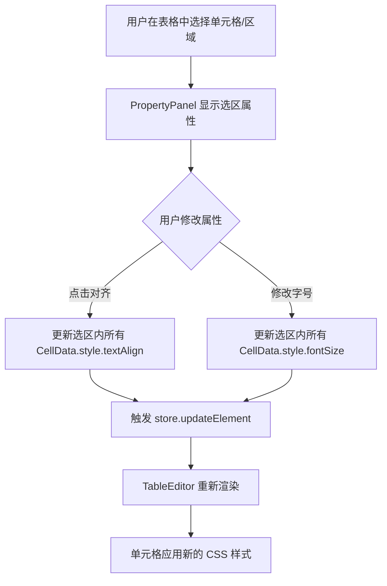

# 表格单元格对齐与字体大小优化计划

本计划旨在增强表格编辑器的功能，允许用户设置单元格内文字的对齐方式（水平和垂直）以及字体大小。

## 1. 修改 `TableEditor.tsx`

目前表格单元格使用了硬编码的对齐类。我们需要将其改为响应 `cell.style` 中的属性。

- **目标**:
  - 使单元格容器和编辑输入框遵循 `cell.style.textAlign`。
  - 支持 `cell.style.fontSize`。
  - 将 `flex` 布局的 `items-center` 和 `justify-center` 改为动态，以支持垂直对齐和水平对齐。

- **具体改动**:
  - 修改渲染逻辑，将 `cell.style` 中的对齐属性映射到 Flexbox 属性或 CSS 类。
  - 确保 `input` 在编辑时也应用相同的样式。

## 2. 增强 `PropertyPanel.tsx`

在属性面板中增加对表格选区（单个或多个单元格）的样式控制。

- **目标**:
  - 提供水平对齐按钮组：左对齐、居中、右对齐。
  - 提供字体大小调节。
  - (可选) 提供垂直对齐按钮组：顶对齐、居中、底对齐。

- **具体改动**:
  - 在 `selectedElement.type === 'table'` 块中，当有 `tableSelection` 时显示这些控件。
  - 批量更新逻辑：遍历选区内的所有单元格并更新其 `style` 属性。

## 3. 状态管理 `useStore.ts`

目前 `useStore` 已经支持 `updateElement`，对于表格内容的深度更新，已经在 `PropertyPanel` 中通过克隆数据实现。我们将维持这一模式，或者考虑添加更方便的单元格更新方法。

---

## Mermaid 流程图

